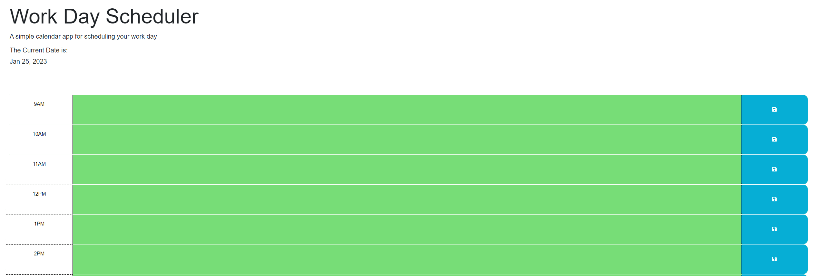

# <Challenge-5>

## Description

Provide a short description explaining the what, why, and how of your project. Use the following questions as a guide:

- The motivation for this project was to learn how to integrate with third party apis and create a homemade scheduler in order to do so. 
- I built this project to display the ability to save input from the user in local storage and update the time slots of a scheduler in real time.  
- What problem does it solve: allows the user to manage a in sync calander. 

The acceptance criteria is as follows:
GIVEN I am using a daily planner to create a schedule
WHEN I open the planner
THEN the current day is displayed at the top of the calendar
WHEN I scroll down
THEN I am presented with time blocks for standard business hours
WHEN I view the time blocks for that day
THEN each time block is color-coded to indicate whether it is in the past, present, or future
WHEN I click into a time block
THEN I can enter an event
WHEN I click the save button for that time block
THEN the text for that event is saved in local storage
WHEN I refresh the page
THEN the saved events persist
-

- [Installation](#installation) N/A
- [Usage](#usage) N/A
- [Credits](#credits) None
- [License](#license) MIT

## Installation

Deployed on the github pages 

## Usage

Link to the website can be found here: https://bulkingfire.github.io/Stathatos_challenge5/
Screenshot:

## Credits

None

## License

MIT

---

🏆 The previous sections are the bare minimum, and your project will ultimately determine the content of this document. You might also want to consider adding the following sections.
